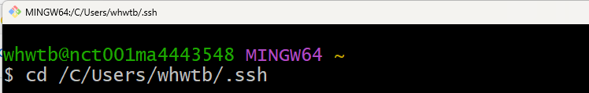
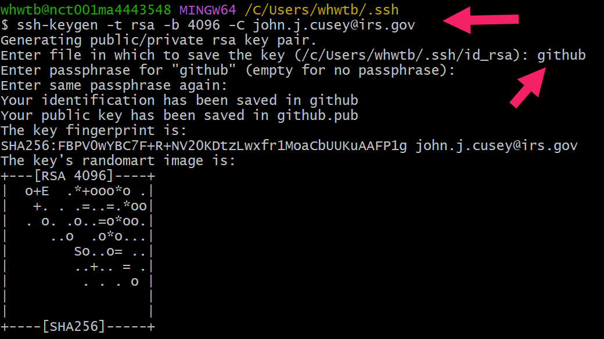
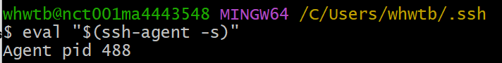

## Steps to set up SSH and GitHub with the Command Line


**Open Git Bash.** Change Directory
```
 cd /C/Users/whwtb/.ssh
```
 

Generate Public Key
```
ssh-keygen -t rsa -b 4096 -C john.j.cusey@irs.gov
```
Name Public Key
```
 github
 ```
 

Storing Public Key with agent
 ```
ssh-add github

```



# [Context](./../README.md)

