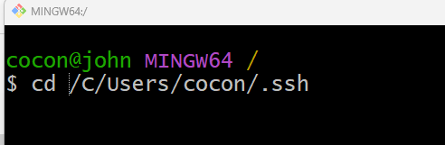

## 🔐 Steps to set up SSH and GitHub with the Command Line

# Introduction
SSH keys allow secure, password-free communication with GitHub. You’ll generate a key pair:

* Public key → uploaded to GitHub

* Private key → stored locally


# **Open Git Bash.** Change Directory

```
 cd /C/Users/<WINDOWS_ACCOUNT_NAME>/.ssh
```


# Generate Public Key
⚠️ Avoid using Windows Command Prompt—it may generate incompatible keys. Always use Git Bash.


```
ssh-keygen -t rsa -b 4096 -C "progressivepull@gmail.com"
```
Save file as: github

 # Add SSH Key to Agent

Storing Public Key with agent
 ```
ssh-add github

```

## 🧨 Common Error


* Could not open a connection to your authentication agent.

## ✅ Solution


``` bash
eval "$(ssh-agent -s)"
ssh-add github
```

# Upload Public Key to GitHub

1. Open: /C/Users/<WINDOWS_ACCOUNT_NAME>/.ssh

2. Copy contents of id_rsa.pub


3. Navigate to GitHub Profile Account
   


-  * select **setting**


4. Go to GitHub Profile → Settings → SSH and GPG Keys
   


5. Click New SSH Key, paste the copied key (MAKE SURE YOU USES THE PUBLIC KEY NOT THE PRIVATE KEY)

 


# [Context](./../README.md)

