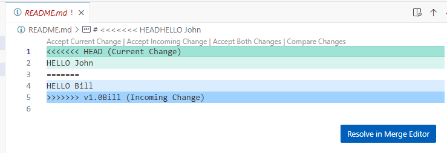
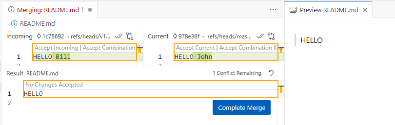

# Guide to Creating and Merging Branches with a Conflict

The following steps will walk you through creating a Git repository, simulating the conflicting changes on two different branches, and then merging them while resolving the conflict manually.

# 1. Set up the repository
First, create a new Git repository and the initial README.md file.

1. Open your terminal or command prompt and create a new directory for your project:

``` sh
mkdir git-merge-demo
cd git-merge-demo
```

2. Initialize a new Git repository:
``` sh
git init
```

3. Create the initial README.md file with the base content:
``` sh
echo "HELLO" > README.md
```

4. Add and commit the file to your master branch:
``` sh
 git add README.md
git commit -m "Initial commit with base HELLO message"
```

# 2. Create and modify the v1.0Bill branch
Next, create a new branch and add Bill's changes.
1. Create and switch to the v1.0Bill branch:

``` sh
git checkout -b v1.0Bill
```

2. Edit the README.md file and change the text to HELLO Bill
``` sh
echo "HELLO Bill" > README.md
```

3. Add and commit the change to the v1.0Bill branch:
``` sh
git add README.md
git commit -m "Update README.md for Bill's version"
```

# 3. Switch back and modify the master branch
Now, switch back to the master branch and simulate the conflicting change.
1. Switch back to the master branch:

``` sh
git checkout master
```

2. Edit the README.md file and change the text to HELLO John:

``` sh
echo "HELLO John" > README.md
```

3. Add and commit the change to the master branch:
``` sh
git add README.md
git commit -m "Update README.md for John's version"
```

# 4. Merge with conflicts

Now, attempt to merge v1.0Bill into master to trigger the conflict.
Start the merge process while on the master branch:
``` sh
git merge v1.0Bill

```

2. Git will stop with a merge conflict and display a message similar to this:

```
Auto-merging README.md
CONFLICT (content): Merge conflict in README.md
Automatic merge failed; fix conflicts and then commit the result.
```
3. Examine the README.md file in your editor. The conflict markers will look like this



* ```<<<<<<< HEAD:``` Indicates the changes from the current master branch.
* ```=======:```Separates the changes from the two branches.
* ```>>>>>>> v1.0Bill:``` Indicates the changes from the branch you are merging (v1.0Bill).

Click on the **Resolve in Merge Editor Button**



# 5. Resolve the conflict
You must now manually edit the file to determine the final, correct content. For this example, you can decide to keep "HELLO John" or "HELLO Bill," or combine them.
1. Open README.md in a text editor.
2. Edit the file to the desired final version. For example, if you want to keep "HELLO John," your file should look like this:
```sh
HELLO John
```
3. Remove all conflict markers (<<<<<<<, =======, >>>>>>>)

# 6. Complete the merge
Once the conflicts are resolved and the file is in its final state, you can finish the merge.
1. Stage the resolved README.md file:
```sh
git add README.md
```

2. Create a new commit to finalize the merge. Git will often provide a pre-populated merge message, which you can use:
```sh
git commit -m "Merge branch 'v1.0Bill' into master, resolved conflict"
```

Your master branch now contains the merged changes with the conflict resolved.

# [Context](./../README.md)