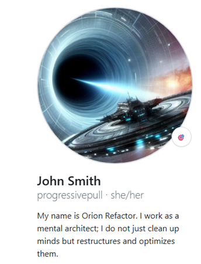
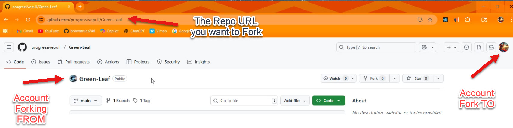
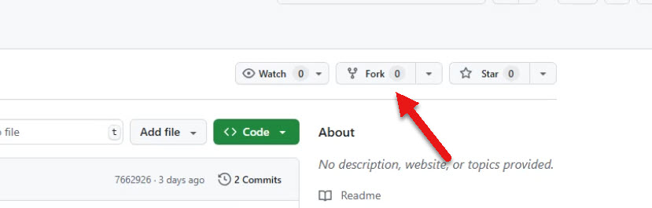
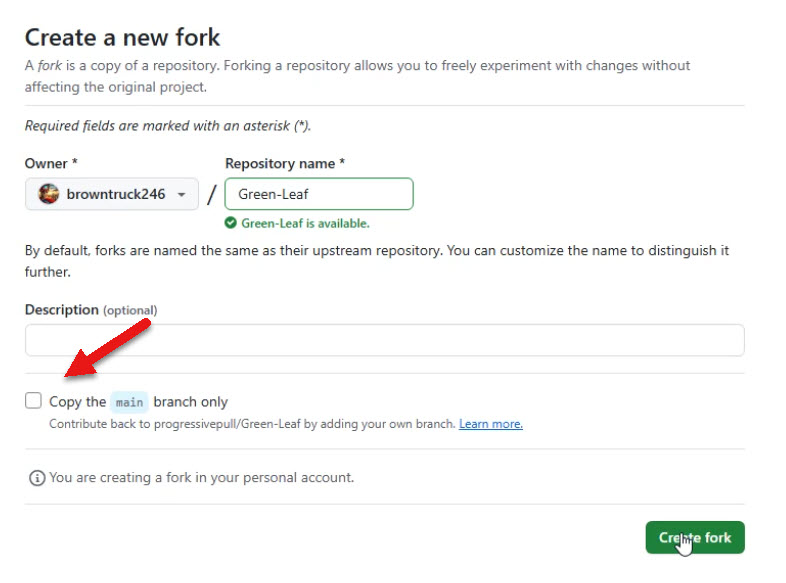
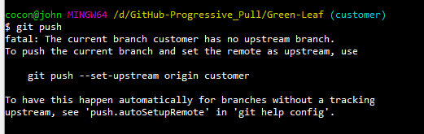

# 🔁 GitHub Pull Request from a Fork

# 🛠️ Setting Up the Production and Worker Codebases
Designating the Production Codebase You're going to use the codebase from the Progressive Pull repository as your production code. This will serve as the main application code, database, and overall source of truth.



https://github.com/progressivepull

Setting Up the Worker Environment You'll create a worker who will fork the production codebase. This forked version will be used for development or task-specific operations, separate from the main production environment.


https://github.com/browntruck246


# 1. Fork the Original Repository
1. Log In First, log in using the designated account. Once logged in, you’ll see your profile icon in the top corner, confirming your identity.

  

2. Locate the Repository Navigate to the Progressive Pull repository. You’ll see the repository name (e.g., “Green-Leaf”) clearly displayed near the top of the page, along with your logged-in username.



## 🍴 Forking the Repository
Initiate the Fork Click the Fork button in the top-right corner of the repository page.



Select Fork Options When prompted, make sure to uncheck the option that says “Copy only the main branch.” Instead, choose to copy all branches and code to ensure a complete fork.



Create the Fork Click Create Fork to finalize the process.

## 2. Clone Your Fork Locally

``` bash
git clone https://github.com/your-username/forked-repo.git
cd forked-repo
```

## 3. Connect to the Upstream Repository
This lets you pull changes from the original repo.



``` bash
git remote add upstream https://github.com/original-owner/original-repo.git
```

Verify the remotes:

``` bash
git remote -v
```

# 🔄 Keeping Your Fork Updated
## 1. Fetch Changes from Upstream

``` bash
git fetch upstream
```

## 2. Merge Upstream Changes into Your Local Branch
``` bash
git checkout main
git merge upstream/main
```

## 3. Push Updated Main to Your Fork
``` bash
git push origin main
```

# 🧠 Summary
You fork → clone → connect to upstream → create a branch → make changes → push → open PR.

You keep your fork updated by pulling from upstream and merging.