# 🔁 GitHub Pull Request from a Fork

## Steps for the Origin Repository where code changes are made 

A pull request is a way to move code from your origin repository to the upstream repository. Typically, the upstream repository is the main project where protected code lives and where changes are eventually deployed to production.

To begin this process, you first navigate to your GitHub origin repository. In this example, I’ll make a simple coding change—specifically, updating the README file. This marks the starting point of the workflow, since the goal is to push code changes that will be reviewed and potentially merged into the upstream repository.

Click the pencil icon at the top right of the README file to begin editing its contents.

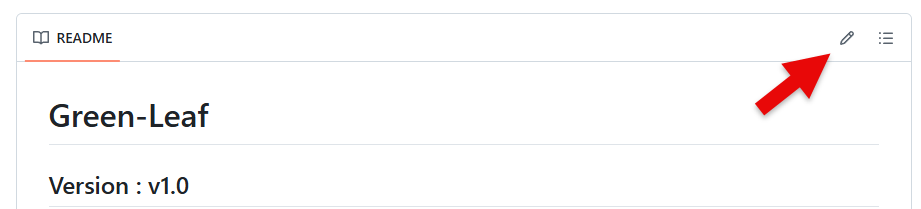

I going change the version, date, and time on the README file. After the changes go to top of the page, click the Commit changes button.

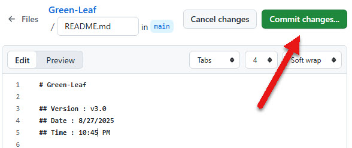

You can see changes below. 

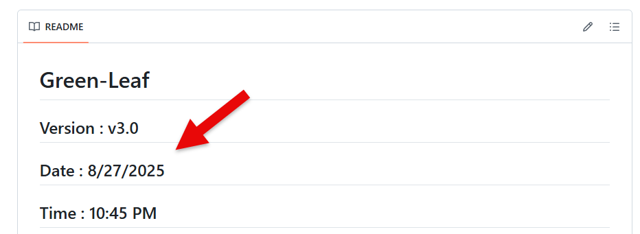

Click the Pull requests at the top of the page start to initiate the Pull Request. 

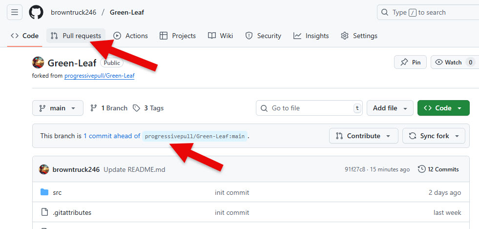

Click the New pull request button. Under the button is section where you would view all existing pull requests, whether open or closed.

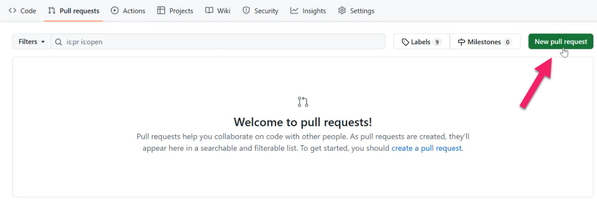

This is the main product code repository, also known as the upstream or base repository. Your personal repository, or origin, is where you make changes that are later proposed for merging into this main repository. Click the Create pull request button.

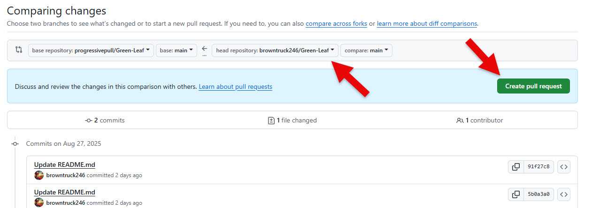

For the new pull request, please ensure the title includes the Jira ticket number and the description is detailed for review. Adhering to a one-ticket-per-pull-request rule is important, as it simplifies the review process and ensures a clear understanding of the changes.

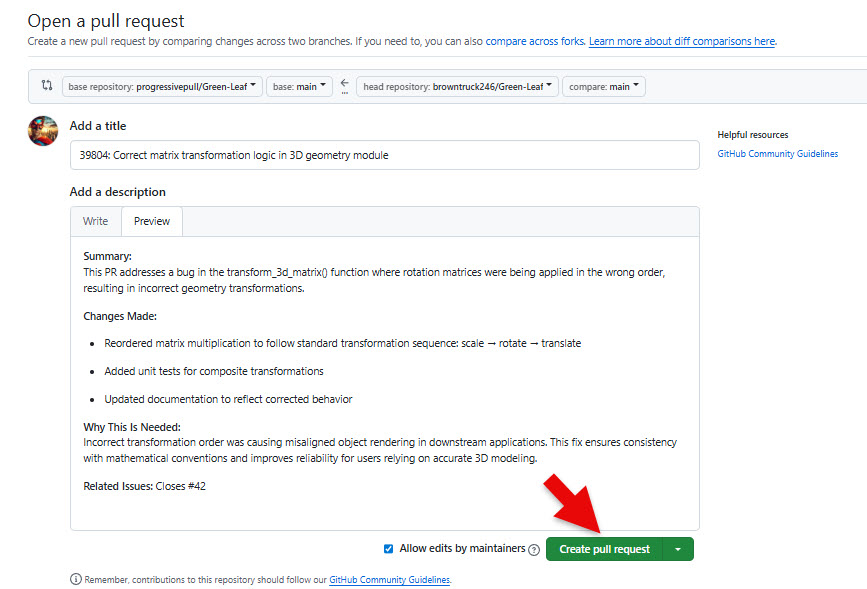

## Steps for the Upstream Repository where code changes are being pulled

I'm heading to the upstream codebase, which lives on the Progressive Pull website. This is our company's production repository—the official org code. It's where I'll be storing the changes.

Within this codebase, you'll need to navigate to the original repository that the current one was forked from. In this case, that's the Green Leaf repo. Once you're in there, look near the pull requests section. You'll see a label next to the Pull Request Label a 1, which indicates there's one active pull request—submitted from another repository into this upstream repo. Click on the Pull Request Label. 

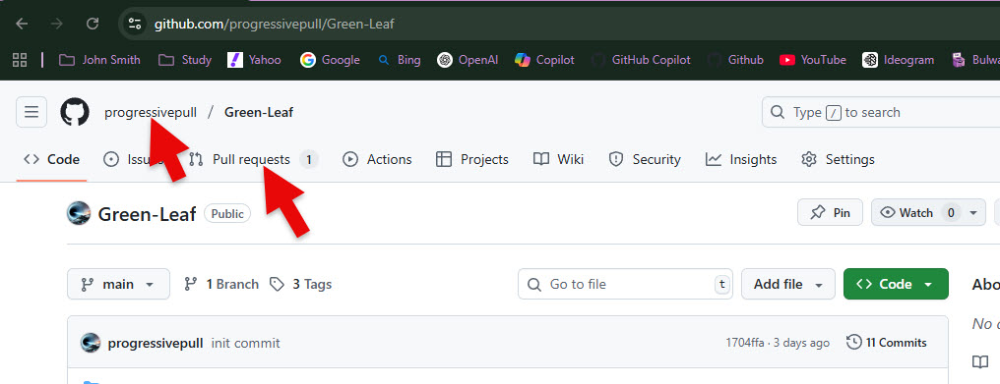

When you click on the Pull Requests tab, you'll be taken to a page that lists all open pull requests. Scroll down to view the details—here you can see who submitted each request and how long it's been open.

This is where we’ll review the code. After examining the changes, you’ll have a few options:

✅ Approve the pull request if everything looks good. Once approved, it can be merged into the main codebase.

💬 Comment directly on the code to provide feedback or ask questions.

🔄 Request changes if something needs to be revised. This sends feedback to the contributor asking them to update their code.

📝 You can also leave a general comment with suggestions or notes that aren’t tied to specific lines of code.

The goal here is to ensure the code meets our standards before it’s committed. Whether you're approving, requesting changes, or just offering guidance, this is the space to collaborate and keep the codebase clean and reliable.

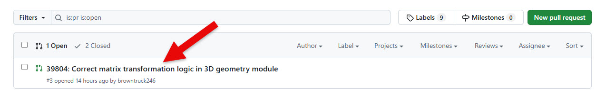

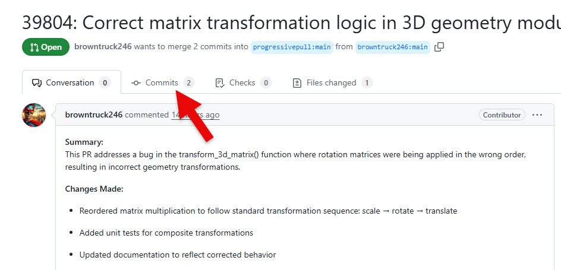

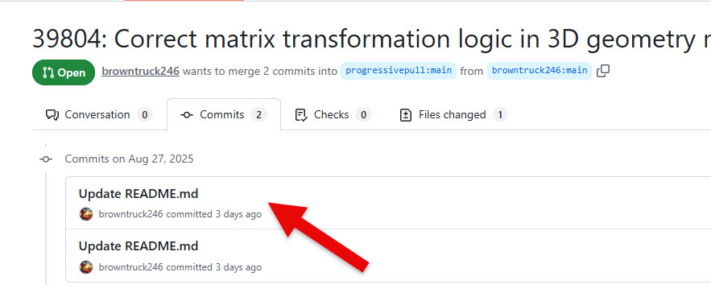

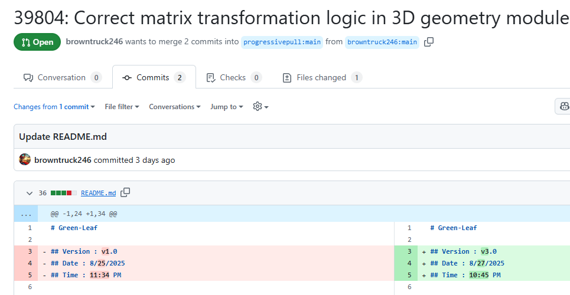

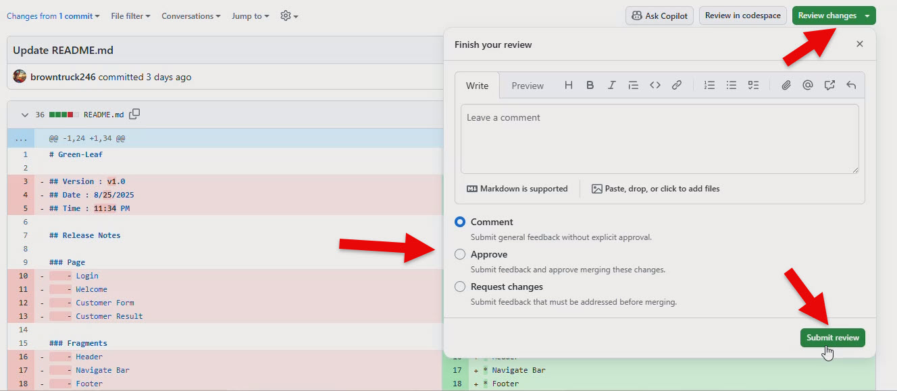

# [Context](./../README.md)

