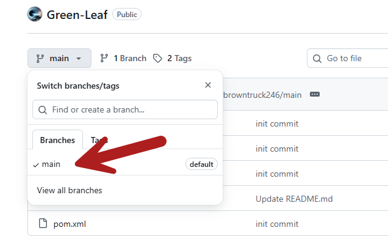
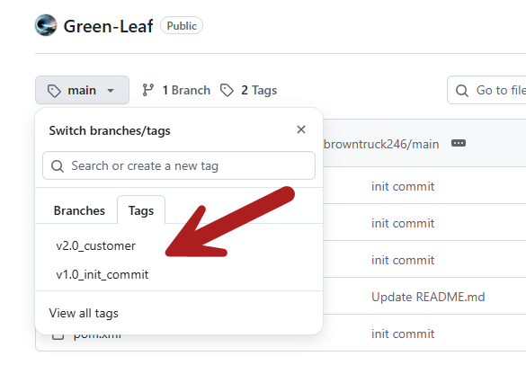

# Git Tag



If click on **View all tags** you will show all the tags. You can download the tag as zip file.



# Understanding Git tags
In Git, a tag serves as a pointer to a specific commit in your repository's history. Think of them like milestones or permanent bookmarks within your project's development timeline.

# Key characteristics
* **Static and Immutable:** Unlike branches which evolve with new commits, a tag remains fixed to the commit it was created on.

* **Marking Releases and Important Points:** Tags are commonly used to mark software release versions (e.g., v1.0, v2.0), important development milestones, or stable points before significant refactoring.

* **Simplified Navigation and Rollback:** Tags allow developers to easily access and revert to specific code versions, facilitating debugging, release management, and understanding project evolution.

* **Collaboration and Automation:** Tags aid in team collaboration by providing common reference points and can trigger automated tasks in CI/CD pipelines.

# Essential Git tag commands
Here's a list of common Git tag commands for managing your repository's tags, along with brief descriptions and examples:

## Listing tags
* ```git tag or git tag -l``` :  Lists all tags in your local repository alphabetically.
* *```git tag -l "pattern"``` :  Lists tags that match a specific pattern (e.g., "v1.8.5*" to list tags starting with v1.8.5).
* ```git ls-remote --tags``` or ```git ls-remote --tags <remote>``` :  Lists tags on a remote repository without fetching them locally.

## Creating tags
* ```git tag <tagname>```: Creates a lightweight tag pointing to the currently checked-out commit.
* ```git tag -a <tagname> -m "message"```: Creates an annotated tag with the provided message.
* ```git tag <tagname> <commit-hash>``` : Tags a specific commit using its hash.

## Showing tag details
* ```git show <tagname>``` : Displays detailed information about a tag, including the commit it points to, the tagger's information (for annotated tags), and the tag message.

## Deleting tags
* ```git tag -d <tagname>``` :  Deletes a tag locally.
*  ```git push --delete <remote> <tagname> ``` : Deletes a tag on a remote repository.
* ```git tag -d <tag1> <tag2>...``` : Deletes multiple tags locally by listing them separated by spaces.

## Sharing tags
* ```git push origin <tagname>``` : Pushes a specific tag to the remote repository named "origin".
* ```git push origin --tags``` : Pushes all local tags to the remote repository named "origin".

## Checking out tags
* ```git checkout <tagname>``` : Switches your repository to the state of the tagged commit, but places your repository in a "detached HEAD" state. According to Git this means that any commits you make in this state won't belong to any branch and will be unreachable except by the exact commit hash.
* ```git checkout -b <new-branch-name> <tagname>``` : Creates a new branch from the tagged commit, allowing you to make changes and commit them within a dedicated branch.
Verifying tags
* ```git verify-tag <tag>``` : Verifies the GPG signature of an annotated tag, ensuring its authenticity and integrity

# Sharing tags
By default, Git tags are not automatically pushed to remote repositories with git push. To share your tags with others, you must explicitly push them:
*  ```git push origin <tag_name>``` : Pushing a single tag
*  ```git push origin --tags``` :  Pushing all local tags

# Demonstrate

Create new tag named 'new-tag'
``` bash
$ git tag new-tag
```

See locally tags
``` bash
$ git tag
new-tag
v1.0_init_commit
```

See remote tags
``` bash
$ git ls-remote --tag
From git@github.com:progressivepull/Green-Leaf.git
b090d74b55475b6112729a1eea1232e6bb6c9d22        refs/tags/v1.0_init_commit
6394fcb18ec5538d958bf0bbaa1eb4af5c5aa48b        refs/tags/v1.0_init_commit^{}
```

Delete new-tag
``` bash
$ git tag -d new-tag
Deleted tag 'new-tag' (was ad26924)
```

See locally tags
``` bash
$ git tag
v1.0_init_commit
```


# [Context](./../README.md)