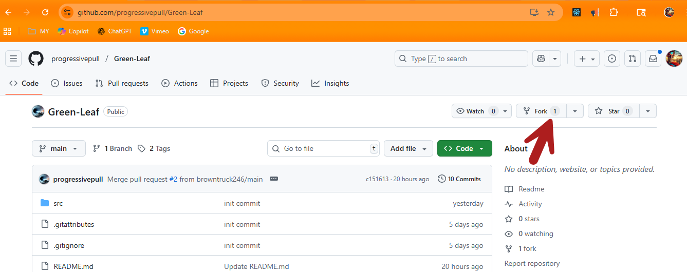

# Knowledge_Transfer_Session_GIT

---
# Context
# Files
* [DOCUMENTS](./DOCUMENTS/)
---
# Command Line Steps
* [Environment Setup](./LESSONS/environment_setup.md)
* [Steps to set up SSH and GitHub with the Command Line](./LESSONS/SSH_and_GitHub_setup.md)
* [Fundamental for Managing your Code with Git](./LESSONS/fundamental_for_managing.md)
* [Configuration Git](./LESSONS/config_git.md)
* [Show the commit history](./LESSONS/)
* [Tags for deploy rollback plan](./LESSONS/tags.md)
* [GitHub Pull Request from a Fork](./LESSONS/forking.md)
* [Upstream Remote Synchronized with Original Fork Project ](./LESSONS/upstream_remote_synchronized.md)
* [Guide to Creating and Merging Branches with a Conflict](./LESSONS/branch-merge.md)
* [Create a Pull Request](./LESSONS/pull_request.md)

# Scripts
* [ Automate Staging, Commit, and Pushing code ](./SCIRIPTS/git_push.md)

# Recommended download location

Saving large files to Microsoft OneDrive can occasionally cause the computer to freeze.

```
cd /F/TRAINING/Knowledge_Transfer_Session_GIT/
```

---
# Definitions

1. Repository (Repo)

A repository is where your project's files and history are stored. It can be local (on your machine) or remote (on a server like GitHub, GitLab, etc.).

2. Commit

A commit is a snapshot of changes made to the files in your repository. It's like saving a version of your work. Each commit has a unique ID (hash) and stores the changes made to the project along with a commit message.

3. Branch


A branch is a separate line of development in your repository. You can create branches to work on features or fixes independently of the main codebase (often called main or master).

4. Merge

Merging is the process of integrating changes from one branch into another, typically from a feature branch back into the main branch.

5. Fork

Forking is creating a copy of someone else’s repository to your own GitHub account. It’s commonly used when contributing to open-source projects.

6. Pull Request (PR)

A pull request is a way to propose changes you've made in a branch (or fork) to be merged into another branch (typically the main repository). PRs are reviewed and discussed before being merged.

7. Clone

Cloning a repository means creating a local copy of a remote repository on your machine.

8. Remote

A remote is a version of your repository that is hosted on the internet or on a network. Common remotes are GitHub, GitLab, Bitbucket, etc.

9. Push

Pushing is the process of sending your local commits to a remote repository so others can access them.

10. Pull

Pulling is retrieving changes from a remote repository to your local machine and merging them into your current branch.

11. Checkout

The checkout command is used to switch between branches or to restore files to a particular state. For example, git checkout <branch-name> switches to that branch.

12. Staging Area (Index)

The staging area is where you prepare changes before committing them. You can add files to the staging area with git add <file>.

13. Diff

A diff shows the differences between files or commits. It can help you review changes before committing or merging.

14. HEAD

HEAD refers to the current snapshot of your working directory. It usually points to the latest commit on your active branch.

15. Rebase

Rebasing is another way to integrate changes from one branch into another, but it rewrites commit history to create a linear history instead of a merge commit.

16. Gitignore

A .gitignore file is used to tell Git which files or directories to ignore when committing changes (like temporary files, build artifacts, etc.).

17. Conflict

A conflict occurs when changes in two branches contradict each other (e.g., two different people edit the same line of a file). Git will flag this, and you'll need to manually resolve the conflict.

18. Revert

Reverting undoes a commit by creating a new commit that reverses the changes of a previous commit. It doesn't delete the commit, it just negates its effect.

19. Tag

A tag is a reference to a specific point in your repository’s history, usually used for marking release points (like v1.0).

20. Pull vs Fetch

git pull is a combination of git fetch and git merge. It fetches changes from a remote and merges them into your local branch.

git fetch only retrieves the changes from the remote but doesn’t merge them.

# Understanding "Working Directory" vs. "Staging Area" vs. "Local Repository"vs. "Remote Repository" in Git


Understanding these fundamental components of Git is essential for managing your code effectively and collaborating seamlessly with others.

### 1. Working directory
* What it is: The actual files and folders on your computer that represent the current state of your project. This is where you actively write, modify, and delete files. Think of it as your workspace or sandbox.

* State: Changes made in the working directory are initially considered **untracked by Git** until you explicitly stage them for a commit.

* Actions: You make changes to your files directly within the working directory.

* Important note: Changes in the working directory are not automatically recorded in Git's history. Failing to stage and commit these changes means they could be lost.

### 2. Staging area (or index)
* What it is: An **intermediate holding area for changes** that you intend to include in the next commit. It acts as a bridge between your working directory and the local repository.

* State: Files in the staging area are considered staged.

* Actions: You use the **git add <file>** command to move changes from the working directory to the staging area. This allows you to selectively choose which changes you want to commit together.

* Benefit: Enables you to create focused and well-organized commits by reviewing and grouping changes before they are permanently saved in the project's history.

### 3. Local repository
* What it is: The **complete history of your project**, including all commits and branches, stored on your local machine within the hidden **.git** directory.

* State: Changes in the local repository are considered committed and are part of the project's permanent history. Each commit represents a snapshot or save point of your project at a specific time, identified by a unique SHA-1 hash.

* Actions: You use the **git commit** command to save the staged changes from the staging area into your local repository, thereby creating a new commit in the project's history.

* Benefits: Allows you to work offline, track changes, experiment with ideas on different branches, and easily revert to previous versions of your code.

### 4. Remote repository
* What it is: A version of your **repository hosted on a server**, commonly on platforms such as GitHub, GitLab, or Bitbucket. It serves as a central location for collaborators to share and synchronize their work.

* State: A remote repository typically stores only the .git versioning data, rather than a direct file tree representing the project's current state.

* Actions:
    - git fetch: Downloads the latest changes from the remote repository to your local repository without automatically merging them.
    - git pull: Downloads and merges the latest changes from the remote repository into your current local branch.
    - git push: Uploads your local commits to the remote repository, making them accessible to others.

# Team Work Flow


### Workflow summary
1. Work in the Working Directory: Make changes to your project files.

2. Stage Changes: Use **git add <file>** to select specific changes from the working directory and place them into the Staging Area, preparing them for the next commit.

3. Commit Changes: Use **git commit -m "Commit message"** to permanently store the staged changes in your Local Repository, creating a new snapshot in the project's history.

4. Share and Collaborate (with Remote Repository): Use **git push** to upload your local commits to the remote repository and git pull (which combines fetch and merge) to get updates from the remote into your local repository.

5. Code Review : During a code review, a team member creates a **pull request** (PR) to formally propose merging their code changes from a local repository into the upstream repository. This action notifies a team lead, who can review, accept, or reject the changes.

6. Update Code :The pull command is used to fetch and download content from the upstream repository and immediately update your local repository to match that content. 

## 🔁 GitHub Section
* **Upstream Repo:** Typically the main repository managed by the team lead or organization.

* **Origin Repo:** A fork of the upstream repo, usually owned by an individual contributor.

* **Push Request:** Likely meant to represent a pull request from origin to upstream (terminology could be improved).

* **Push:** Correctly shows pushing changes from origin to upstream.

* **Pull:** Correctly shows pulling updates from GitHub to the laptop.

## 💻 Laptop Section
* **Working Directory → Staging Area → Local Repo:** This is the standard Git flow:

    - git add moves changes to staging.

    - git commit saves them to the local repo.

* **Local Repo → Origin Repo:** Push Request 

# Understanding "Remote" vs. "Origin" in Git

It's common for newcomers to Git to get these terms confused, so let's clarify the distinction:

### Remote: The General Concept
In Git, a **remote is a term for any other Git repository your local repository is configured to communicate with**. This could be a repository hosted on a service like GitHub, GitLab, or Bitbucket, or even another repository on your local network or a different directory on your machine.

* Remotes enable collaboration: They are the backbone of teamwork in Git, allowing developers to share their changes and synchronize their work.

* Bookmarking for URLs: Think of remotes as convenient aliases or bookmarks for the URLs of other repositories, making it easier to interact with them.

* Beyond Just Sharing: Remotes also play a crucial role in backing up your code and even deploying applications to different environments.

### Origin: The Default Remote Name
When you **clone a repository using git clone, Git automatically sets up a remote connection back to the repository you cloned from**. By convention, Git names this primary remote origin.

* A starting point: origin essentially represents the repository where your local copy originated.

* Convenience: It acts as a shortcut for the URL of that initial repository, saving you the hassle of typing out the full URL every time you want to pull updates or push your changes.

* Default but not fixed: While origin is the default, you can rename this remote or even add other remotes with different names to connect to other repositories.

### Key takeaways
* Remote is the general term for any external Git repository your local repository interacts with.

* Origin is a specific name, the default alias for the primary remote from which your local repository was cloned.

* You can configure and manage multiple remotes in a Git repository, each with its own name and URL.

By understanding this distinction, you gain a clearer picture of how Git's distributed nature facilitates collaboration and how you interact with other repositories within the Git ecosystem.

# Understanding "Master Branch" vs. "Main Branch" in Git

### Master vs. Main Branch in Git: A naming shift
In the world of Git, "master" and "main" essentially refer to the same thing: the primary or default branch of a repository. This is the branch that's typically considered the most stable and ready for deployment.

### The change to "main"
Historically, the default branch in Git repositories was named "master". This naming convention stemmed from the use of BitKeeper, a predecessor to Git, which used a "master/slave" terminology.

However, the term "master" has been increasingly recognized as having negative connotations due to its historical association with slavery. In response to calls for more inclusive language in tech, many organizations and platforms, including GitHub, have transitioned to using "main" as the default branch name.

---


# Clone

In Git, the **git clone** command is used to create a local copy of an existing Git repository. Think of it like making a download of the entire project, including all its files, commit history, and branches, and putting it on your local machine.

``` bash
$ git clone https://github.com/progressivepull/Green-Leaf.git

```



# Fork

In the context of Git and platforms like GitHub, GitLab, and Bitbucket, "forking" refers to creating a personal copy of an entire repository (project) on the platform.

## 1. What is a fork?
* **A personal copy:** When you fork a repository, you create a complete copy of it under your own account.

* **Independent development:** This copy exists on the server (e.g., GitHub) and allows you to make changes without affecting the original project.

* **Foundation for your ideas:** You can then treat this forked repository as a starting point for your own project or as a base for contributing to the original project.
## 2. Why use forking?
* **Open-source contributions:** You can fork an open-source project to make your own changes, experiment, and then propose those changes back to the original project via a pull request.
* **Independent development:** You can also use a fork to maintain a separate version of the code that diverges from the original project's direction.
* **Testing and experimentation:** Forks provide a safe environment to test new features or fix bugs without impacting the original codebase.

## 3. Fork vs. clone

|Aspect 	|Forking	|Cloning|
|-----------|-----------|----------|
|Scope|	Creates a copy of the repository on a platform like GitHub under your account.	|Creates a local copy of a repository on your machine.|
|Location|	Server-side.|	Local.|
|Ownership|	You own the fork.|	You don't own the repository.|
|Purpose|	Contributing or maintaining a derivative.|	Local development or private work.|
|Integration|	Requires a pull request to the original repository.|	Changes pushed to the original remote.|

# Upstream

In Git, the term "upstream" refers to the **original or main repository that your current repository was cloned or forked from**. Think of it as the "source of truth" for the project. When you're working with a forked repository (your personal copy), the original repository is considered upstream.

## Key points about upstream

* **Origin vs. Upstream:** While "origin" typically refers to your forked repository, "upstream" signifies the original repository that you don't have direct write access to.

* **Syncing Changes:** The primary use of upstream is to keep your local or forked repository synchronized with the latest updates and bug fixes from the original project. You'll primarily fetch changes from the upstream repository.

* **Contributing to Open Source:** When you want to contribute to an open-source project, you'll typically fork the project, clone your fork locally, and then set the original repository as an upstream remote. After making your changes, you'll push them to your fork (origin) and then submit a pull request to the upstream repository to merge your changes into the main project.

## Setting upstream

You can configure a remote repository to be considered upstream by using

``` bash
 git remote add upstream <upstream_repository_url>
 ```

# Why use git remote add upstream <upstream_repository_url>?
The command ```git remote add upstream <upstream_repository_url>``` is primarily used when working with a forked Git repository. It serves the crucial purpose of establishing a **connection between your local copy of a forked repository and the original repository from which it was forked**, often referred to as the "upstream" repository.

Here's a breakdown of the key reasons why this command is essential:

1. Keeping your fork synchronized with the original project:
* When you fork a repository, you create a personal copy that is initially identical to the original.

* However, as the original project continues to be developed, your fork will become outdated unless it's explicitly updated.

* The git remote add upstream command allows you to add the original repository as a new remote, effectively creating a link back to it.

* With this link established, you can then fetch the latest changes from the upstream repository and merge or rebase them into your local fork, keeping your codebase up-to-date with the official project, according to Graphite.

2. Facilitating contributions to the original project:
* If you're working on a feature or bug fix that you intend to submit back to the original project, having an upstream remote is critical.

* By regularly fetching and merging changes from upstream, you ensure that your contributions are based on the latest version of the code, minimizing the risk of merge conflicts when you later submit a pull request.

3. Understanding "origin" vs. "upstream":
* When you clone your forked repository, Git automatically creates a remote named "origin" that points to your personal fork.

* This "origin" remote is what you'll typically use to push your local changes to your fork.

* In contrast, the "upstream" remote (which you add manually) represents the original repository from which you forked, where the official development happens.

In essence, the ```git remote add upstream``` command creates a connection that allows you to:
* Track the progress of the original project.
* Easily update your fork with the latest changes.
* Streamline the process of contributing your own changes back to the original project

## Keeping your fork updated
Regularly pulling or fetching changes from the upstream repository ensures that your fork stays in sync with the latest updates from the main project. This helps prevent potential conflicts when you later attempt to submit your contributions back to the main project.

In essence, understanding and utilizing upstream in your Git workflow is crucial for:

* **Effective collaboration:** Staying updated with the latest changes from the main project when working in a team or contributing to open-source projects.

* **Codebase integrity:** Maintaining a consistent codebase by regularly merging updates from the original repository.

* **Streamlined contributions:** Making it easier to contribute back to the original project by ensuring your changes are based on the latest version of the code.

# Merge

Using the diagrams below, we will see how git merge works what the repository looks like before the merge and how Git creates a new merge commit to combine histories.

Key Elements
* **Common Base:** The commit from which both the main and feature (dev) branches originated.
* **Main Branch (in blue):** This is your production or main branch where stable code lives.
* **Feature/Dev Branch (in green):** This branch is where new development work has occurred.
* **Main Tip:** The latest commit on the main branch.
* **Feature Tip:** The latest commit on the feature branch.


During the merge, Git compares the latest commit of the main branch (Main Tip), the feature branch (Feature Tip), and their shared ancestor (Common Base). If there are no conflicts, Git automatically creates a new merge commit combining both histories.

# Rebase vs. Merge


## Git rebase vs. merge: choosing the right tool for the job
Both git rebase and git merge are powerful tools in Git for integrating changes between branches, but they approach the task differently and with different consequences for your project's commit history. The choice between them depends on your workflow, your team, and what kind of history you want to maintain.

1. Git merge
* How it works: git merge takes the **changes from a branch (e.g., your feature branch) and integrates them into the target branch (e.g., the main branch) by creating a new merge commit**. This merge commit has two parent commits: the tip of your feature branch and the tip of the target branch.

* Benefits:
    - Preserves full history: Merging keeps a complete and detailed record of the entire history of both branches, including the exact point in time and the context of the integration.

    - Safer for shared/public branches: Since merging doesn't rewrite history, it's generally considered safer for branches that other team members are actively working on, as it avoids potential conflicts and confusion when they pull updates.
    - Clear merge points: Merge commits act as historical markers, clearly indicating where two lines of development converged.
* Drawbacks:
    - Potentially messy history: Frequent merges, especially in a busy repository, can lead to a cluttered commit history with numerous merge commits, making it harder to track individual changes or understand the project's evolution.
    -Can be difficult to pinpoint changes: With many merge commits, using tools like git bisect to find the exact commit that introduced a bug can become more challenging.
2. Git rebase
How it works: git rebase **rewrites history by taking the commits from one branch (e.g., your feature branch) and replaying them on top of a new base commit (e.g., the latest commit on the main branch)**. This makes it appear as though you created your branch from that later point in time.
* Benefits:
    - Clean and linear history: Rebasing creates a straight, linear commit history, eliminating the merge commits that can clutter a project's log. This can make the history easier to read and understand.

    - Cleaner and easier pull requests: A rebased history presents a clearer, more logical sequence of changes, simplifying the review process and focusing on the relevant updates.

    -Improved debugging and code review: The simplified history makes it easier to use commands like ```git log```, ```git bisect```, and ```gitk``` to trace changes and pinpoint when bugs were introduced.

* Drawbacks:
    - Rewrites history, potentially breaking shared branches: This is the biggest downside. If you rebase a branch that has already been pushed to a remote repository and others have based work on those original commits, rebasing can lead to conflicting histories and necessitate force pushes, which can be disruptive for the team.

    - Can lead to complex conflicts during the rebase process: When changes conflict, Git applies commits one by one during a rebase, so you might have to resolve the same conflict multiple times if it occurs in different commits within the rebased branch.

    - Steeper learning curve: Understanding the implications of rebasing and using interactive rebase options effectively takes practice and a careful approach.

### Choosing between merge and rebase
* Use merge when:
    - You are collaborating on shared branches where preserving the full history and minimizing risk are the top priorities.
    - You want to clearly see the points in time where branches diverged and then came back together.

* Use rebase when:
    - You are working on a local, private feature branch and want to clean up your commit history before merging into a shared branch.
    - A clean, linear history is highly valued (e.g., in open-source projects or projects with a long-term focus).
    - You are comfortable with the concept of rewriting history and understand the potential risks.

**Important note:**
 Never rebase a public or shared branch that others have already pulled down and based their work on. This can cause significant issues and confusion for your team members, forcing them to resolve complex conflicts or re-do their work.

# References
* [Atlassian](https://www.atlassian.com/git/tutorials)       
Markdown is a lightweight markup language that uses a simple plain-text formatting syntax to create structured and formatted documents.
* [Markdown Cheat Sheet - Markdown Guide](https://www.markdownguide.org/cheat-sheet/)
* [Basic Syntax - Markdown Guide](https://www.markdownguide.org/basic-syntax/)

